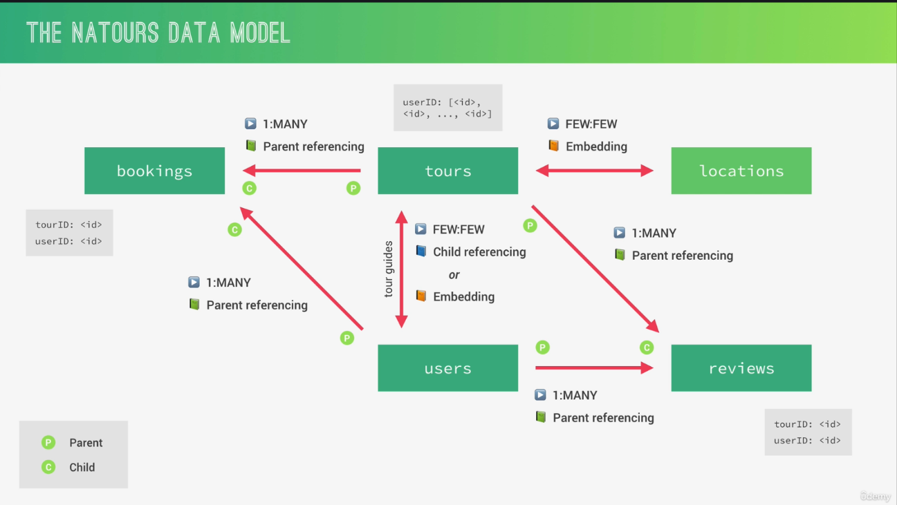

# Natours App

A full-stack tour booking application built with **Node.js**, **Express**, **MongoDB**, **Mongoose**, and **Pug**.  
This project includes a REST API, server-rendered pages, authentication/authorization, image uploads, geospatial tour queries, and review aggregation.

## Highlights

- RESTful API for tours, users, and reviews
- Server-side rendered views using Pug
- JWT authentication with cookie-based sessions
- Role-based authorization (`user`, `guide`, `lead-guide`, `admin`)
- Secure middleware stack (Helmet, rate limiting, NoSQL injection/XSS/HPP protection)
- Tour image upload + processing using Multer and Sharp
- Geospatial endpoints (`tour-within`, `distances`)
- Aggregation pipelines for stats and monthly plans
- Review system with automatic tour rating recalculation

## Tech Stack

- Runtime: Node.js
- Framework: Express.js
- Database: MongoDB + Mongoose
- Templating: Pug
- Auth: JWT + cookies
- Media: Multer + Sharp
- Email: Nodemailer (Mailtrap/SendGrid)
- Frontend bundling: Parcel

## Project Structure

```text
natours-app/
  config/           # DB connection
  controllers/      # Route handlers
  middlewares/      # Auth, rate-limiter, error handler, etc.
  models/           # Mongoose models (Tour, User, Review)
  public/           # Static assets (css, js, images)
  routers/          # Express route modules
  utils/            # Helpers (API features, mailer, factory handlers)
  views/            # Pug templates
  dev-data/         # Seed data + import script
  app.js            # Express app setup
  server.js         # Entry point
```

## Getting Started

### 1. Clone and install

```bash
git clone https://github.com/shreyan-naskar/natours-app.git
cd natours-app
npm install
```

### 2. Configure environment variables

Create/update `.env` in project root.

Required variables:

```env
PORT=5000
NODE_ENV=development

DB=mongodb+srv://<username>:<PASSWORD>@<cluster>/<database>?retryWrites=true&w=majority
DB_PASSWORD=<your-db-password>

JWT_SECRET=<your-jwt-secret>
JWT_EXPIRES_IN=90d
JWT_COOKIE_EXPIRES_IN=90

MAILTRAP_HOST=<mailtrap-host>
MAILTRAP_PORT=<mailtrap-port>
MAILTRAP_USER_NAME=<mailtrap-username>
MAILTRAP_PASSWORD=<mailtrap-password>
MAIL_FROM=<from-email>

SENDGRID_USERNAME=<sendgrid-username>
SENDGRID_PASSWORD=<sendgrid-password>
```

### 3. Run the app

```bash
npm run dev
```

Server starts on `http://localhost:<PORT>`.

## NPM Scripts

- `npm run dev` - Start server with Nodemon
- `npm start` - Start server in normal mode
- `npm run debug` - Start server with `ndb`
- `npm run watch:js` - Watch and bundle frontend JS with Parcel
- `npm run build:js` - Current script also runs Parcel watch mode

## Seed / Reset Development Data

From project root:

```bash
node dev-data/data/importData.js --import
node dev-data/data/importData.js --delete
```

## Core API Routes

Base path: `/api/v1`

### Tours

- `GET /tours`
- `POST /tours` (protected: `admin`, `lead-guide`)
- `GET /tours/:id`
- `PATCH /tours/:id` (protected: `admin`, `lead-guide`)
- `DELETE /tours/:id` (protected: `admin`, `lead-guide`)
- `GET /tours/top-5-cheap`
- `GET /tours/tour-stats`
- `GET /tours/monthly-plan/:year` (protected: `admin`, `lead-guide`, `guide`)
- `GET /tours/tour-within/:distance/center/:latlng/unit/:unit`
- `GET /tours/distances/:latlng/unit/:unit`

### Users/Auth

- `POST /users/signup`
- `POST /users/login`
- `GET /users/logout`
- `POST /users/forgotPassword`
- `PATCH /users/resetPassword/:token`
- `PATCH /users/updateMyPassword` (protected)
- `PATCH /users/updateMe` (protected)
- `DELETE /users/deleteMe` (protected)
- `GET /users` (admin only)
- `GET /users/:id` (admin only)
- `PATCH /users/:id` (admin only)
- `DELETE /users/:id` (admin only)

### Reviews

- `GET /reviews` (protected)
- `POST /reviews` (protected: `user`, `admin`)
- `GET /reviews/:id` (protected)
- `PATCH /reviews/:id` (protected: `user`, `admin`)
- `DELETE /reviews/:id` (protected: `user`, `admin`)
- Nested route: `POST /tours/:tourId/reviews`

## API Query Features

Supported query parameters on collection routes:

- Filtering: `?difficulty=easy&price[lt]=1000`
- Sorting: `?sort=price,-ratingsAverage`
- Field limiting: `?fields=name,price,summary`
- Pagination: `?page=2&limit=10`

## Security Middleware

The app includes:

- `helmet` for HTTP security headers (with CSP config)
- `express-rate-limit` on `/api`
- `express-mongo-sanitize` for NoSQL injection protection
- `xss-clean` for XSS sanitization
- `hpp` for HTTP parameter pollution prevention
- `cookie-parser` for JWT cookie handling

## Views

Server-rendered routes include:

- `/` - Overview page
- `/tour/:slug` - Tour details page
- `/login` - Login page
- `/me` - Account page (protected)

## Database Model



